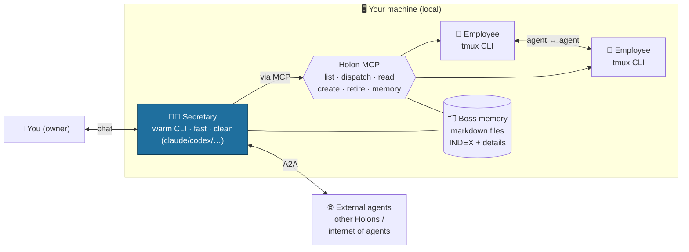
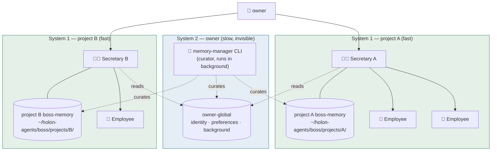

# Manage Your CLI

**Turn your CLI subscriptions (Claude Code, Codex, Gemini, Qwen, …) into a managed
team of agents.** A lean **Secretary** you chat with creates and dispatches
**employee** agents to do the heavy work — all running on *your own* CLI logins.

- **No API keys.** It drives the official CLI you're already logged into. Your
  subscription, your machine, your auth — we never touch tokens.
- **Thin shell.** All the intelligence is the CLI's. We add only **context, memory,
  orchestration, and a clean UI**. No RAG, no vector DB, no bespoke "AI" layer.
- **Gets better for free.** Every model/CLI upgrade upgrades the whole product.
- **You keep direct control.** Create a CLI agent from the app — *or* attach one you
  already launched yourself. Either way it's your own `tmux` session: `attach` and drive
  it directly anytime. We never sit between you and your CLI or lock you out of it.

> **Ban-safe by design:** each user drives the *official* CLI on their *own* machine
> with their *own* subscription — the safest, most vendor-aligned form of use. We
> never extract tokens, run subscriptions on a server, or share accounts.

## Why

**The CLI is the frontier.** Today, the fastest, most capable, and most efficient way
to drive AI is the official agent CLI — Claude Code, Codex, Gemini, Qwen. Professionals
already live there; nothing else keeps pace with it.

But two real problems remain:

- **For professionals — managing many CLIs gets expensive.** Once you're running
  several CLI agents across projects and machines, keeping track of who's alive, who's
  doing what, the shared context and memory, and coordinating them becomes a job in
  itself.
- **For everyone else — the terminal is unfamiliar.** The most powerful AI tool on the
  planet is locked behind a command line most people won't touch.

Today's tools take the opposite bet: each new agent framework rebuilds the **harness**
— its own planner, tool router, memory layer, prompt-stack and orchestration engine — on
top of the same underlying model. Our view: **the harness is exactly the part the
frontier model itself will absorb next** (better tool-use, longer context, internal
memory, native agent loops). Whatever a framework hard-codes today, the model will do
inside its own loop tomorrow — and at that point the heavy harness becomes dead weight:
**slower (high latency), more brittle, and always a step behind the frontier** because
it re-implements intelligence instead of using the model directly.

So we don't build a harness. We treat the CLI (which already ships the model's latest
loop) as the harness, and add only the thin management layer it doesn't have.

**We do the opposite: reuse the CLI, don't replace it.** We keep exactly what makes the
CLI the fastest and most professional path, and add a thin management layer on top — a
Secretary, a dynamic team, shared memory, and a clean UI. Professionals get
**management without losing CLI speed**; everyone else gets a **friendly surface over a
pro-grade tool**. We don't build AI — we orchestrate the AI you already pay for, and we
get faster and smarter every time the CLI does.

What that looks like in practice:

- **Two side-by-side surfaces per agent**: the **raw CLI window** (live tmux mirror —
  every keystroke, every tool call, every line of output) PLUS a **clean summary feed**
  (post-turn condensation in plain language). Professionals can drop into the CLI
  window to inspect / drive directly; the summary surface is what the user reads and
  what gets relayed to mobile / WeChat. Same agent, two views.
- **The user talks to the Secretary, not to the CLI**. The Secretary is the only
  voice the owner deals with day-to-day. It reads the team's CLIs through MCP, dispatches
  work, and reports back in plain language. The CLIs stay watchable underneath, but they
  are workers — not the user-facing surface.
- **Every CLI is a manager-by-default**. Modern CLIs (claude-code, codex, gemini) can
  fan out their own sub-agents internally — *that's the CLI's own capability, not ours*.
  We only **define the role** (persona + tools + memory + cwd) and let the CLI's own
  loop handle decomposition. No external orchestration engine. The CLI is the planner;
  we are the org chart.

## Overhead

A core goal: **add as little overhead as possible over driving the CLI directly.**
Because we reuse the official CLI's own *warm* process and just stream its I/O — we
re-implement nothing — the overhead is essentially **within measurement noise**.

Benchmark — warm turn, same model (`claude-haiku`, low effort), same prompt, server-side:

| | per-turn latency |
|---|---|
| **Direct CLI** (`claude -p`, warm) | ~1.19 s |
| **Through Manage Your CLI** (warm) | ~1.07 s |
| **Overhead** | **≈ 0** (within model jitter) |

- The CLI's one-time **cold start** (~4–6 s) is paid **once per session and pre-warmed
  before you type** — so you never wait for it; every turn after is ~1 s.
- Contrast with heavy wrappers that re-implement intelligence: seconds of added latency,
  and always a step behind the frontier. We add ~nothing — we *are* the CLI, managed.

*(Server-side figures; your network/browser are separate and unaffected by this layer.)*

## Architecture



**Connection structure:** *local agents ↔ Secretary ↔ you ↔ the outside* — an
**internet of agents**. The Secretary is the hub: it coordinates your local team and
is the single gateway out to other people's agents (over the **A2A** standard).

### System 0 / System 1 / System 2 — the memory hierarchy

Daniel Kahneman partitioned the human mind into a **fast** intuitive
**System 1** and a **slow** deliberate **System 2**. Recent
vision-language-action (VLA) robotics architectures (NVIDIA Helix,
Figure 02) adopt the same split as a fast policy + slow planner.

**We apply this directly to agent memory** — and extend it downward
with a **System 0** that Kahneman didn't model:

| Layer | Name | What it holds | Speed |
|---|---|---|---|
| **System 0** | 会话 — session / reflexive | The current dispatch turn's working memory inside a warm CLI process. Ephemeral. *(below Kahneman — he didn't model it)* | ~1 second |
| **System 1** | 项目 — project | The project secretary's accumulated state + dispatch intent + active jobs + project-scoped boss-memory. One instance per project. *(Kahneman's "fast, automatic, intuitive")* | Hours → weeks |
| **System 2** | owner — identity | Owner's long-term needs, preferences, accumulated background knowledge across all projects. One instance per owner, shared by every project secretary. *(Kahneman's "deliberate, effortful, slow")* | Months → years |



**System 0 lives inside each colored box** — every CLI's warm process
holds its own session memory; we don't draw it as a separate node
because it's per-turn and ephemeral.

**Harvest-on-retire — like a human life.** When a container is
destroyed, its memory doesn't all get saved — it gets **distilled then
discarded**. A small durable fraction bubbles **up** the hierarchy;
the time-bound rest is dropped.

The human parallel is exact. You don't remember every meal you ate
this month, but you do remember "I like spicy food" — a
higher-abstraction trace that survived the curation. The same shape
runs through all three layers:

| Container destroyed | Who harvests | What bubbles up | What gets discarded |
|---|---|---|---|
| CLI employee retired | The owning secretary | Durable contributions, role-shape lessons → project boss-memory (System 1) | Per-turn chat, scaffolding, resolved threads |
| Project retired | Owner (or an optional super-agent if the owner spawns one) | Owner-relevant decisions, patterns, references → owner boss-memory (System 2) | Project-internal mechanics, time-bound scope |
| Owner | — | Terminal — no layer above | — |

The **memory-manager** (System 2's curator) is what runs this
distillation — it's another CLI agent, runs in the background, and
shapes the surviving memory the way a person sleeps on a day's events.
Old projects get archived to `_archived/` (we don't grep history away,
just retire it from active context), preserving the same "fadeable but
recoverable" quality biological memory has.

> **Why this matters as differentiation.** No agent framework we've
> found applies Kahneman's System 1 / System 2 to agent memory; most
> (Letta, Mem0, Zep, Cognee, AutoGen, CrewAI) treat memory as a single
> service. We get the 3-layer split for free by being a **thin shell**:
> System 0 is the CLI's own loop, System 1 is the secretary's warm
> process, System 2 is the curator agent. No DB, no framework — just
> markdown files and CLIs arranged in a recursion of the same pattern.

> **Personal edition (this repo): single-machine, no database.** Everything lives in
> local files — boss memory is markdown, owner state is a single SQLite file used as
> a key-value store for personal preferences, and the CLI agents themselves keep state
> in their own tmux sessions / `CLAUDE.md` files. No server, no cloud, no shared DB.
>
> **Commercial edition (planned): may add a database** for multi-tenant / team
> scenarios — shared roster, cross-machine handoff, audit, billing. The personal
> edition stays file-only on purpose: zero ops, zero lock-in, owner can grep / version
> / back up everything as plain files.

### Two orthogonal axes: shell vs gateway

Every connection above is "agent ↔ agent," but they differ on **two independent
axes** — don't conflate them:

- **Shell (tmux)** — a *local* wrapper that makes a CLI agent **watchable +
  driveable**. Local overhead (screen scrape), no network. The Secretary runs
  **without** a shell (warm stream → fast); employees run **inside** a tmux shell
  (so you can supervise them).
- **Gateway** — *network* transport to a **remote** party (A2A peers, the
  WeChat/iLink bridge, the mobile thin-client). Decides whether the agent is local
  or remote.

|                      | no shell                   | tmux shell              |
|----------------------|----------------------------|-------------------------|
| **local**            | Secretary (fastest, ~1s)   | Employee (supervisable) |
| **remote (gateway)** | A2A peer · WeChat · mobile  | —                       |

**Create vs connect.** Internal agents are **created live** by the Secretary
(`create_agent`) — you own their lifecycle (warm Secretary / tmux employees).
External agents already exist; you **connect** to them (A2A handshake) — no spawn
cost, but manual setup and not yours.

**Is the gateway too slow? No — not for agent chat.** LLM generation takes
*seconds*; a gateway hop is *tens of milliseconds* — noise next to the model's
thinking time. The real latency is **cold-start**, which is why the Secretary is
kept *warm*. So: keep the hot path (you ↔ Secretary) **local + warm** (no gateway,
no shell); give employees a **tmux shell** (supervision); reach inherently-remote
agents over a **gateway** (latency is fine). Don't drop a gateway to "go faster" —
keep agents warm instead.

## The 6 core pieces

| # | Piece | What it is |
|---|---|---|
| 1 | **CLI–tmux shell** | Launch/drive official CLIs — Secretary as a *warm* headless process (~1s/turn); employees in persistent *tmux* (watchable, driveable). |
| 2 | **Agent ↔ agent comms** | Secretary orchestrates employees via the **Holon MCP**; **A2A** for event-driven + cross-machine ("internet of agents"). |
| 3 | **Clean UI** | Chat with the Secretary (clean reading surface), live roster, create-CLI flow. |
| 4 | **Persistent agents** | The Secretary (always-warm) + long-term employees (with a "soul" doc). |
| 5 | **Dynamic-agent UI** | Employees are created/retired on demand; the roster reflects them live. Everything dynamic — nothing hardcoded. |
| 6 | **Memory management** | File-based (markdown) memory at the *boss*: an index + detail files, **progressive disclosure**. A periodic memory-manager agent consolidates short→long term. No vector DB. |

## How it works

- **Secretary** = a *warm, persistent* official-CLI process (e.g. `claude --print
  --input-format stream-json …`, lean model + low effort). It pays the CLI cold-start
  **once**, then answers in ~1s and streams cleanly. It does light work itself and
  **dispatches heavy work to employees**.
- **Employees** = official CLIs in their own tmux sessions — you can watch or drive
  any of them directly. Created short-term by default, long-term on request.
- **Memory lives at the boss** as plain markdown (employees fetch what they need), so
  agents can be created and destroyed freely without losing knowledge. Each agent also
  has its own native `CLAUDE.md`/`AGENTS.md`.
- **No LLM config.** You log into your CLI(s) once; the app detects and uses them.

## Install & Use

**Full install guide: [`INSTALL.md`](INSTALL.md)** (one page, copy-pasteable
commands). The version below is the at-a-glance flow.

### 0. Pre-flight (recommended)

```bash
bash scripts/check-deps.sh
```

Reports MISSING / OK for every required and optional dependency, with the
exact distro-specific install command for each missing one.

### 1. Prerequisites

- **Node.js 22.x** with corepack: `corepack enable`
- **pnpm 9.10.0**: `corepack prepare pnpm@9.10.0 --activate`
- **tmux** + **git**
- **At least one CLI subscription** logged in on your machine:
  - Claude Code: `npm install -g @anthropic-ai/claude-code` then `claude` (OAuth)
  - Codex: `npm install -g @openai/codex` then `codex` (OAuth)
  - Gemini: `npm install -g @google/gemini-cli` then `gemini` (OAuth)
  - Qwen: per Alibaba Cloud docs, then `qwen login`

No API keys are ever entered into this app — it drives your existing CLI login.

### 2. Desk (WSL2 / Linux)

Dev mode (recommended, HMR-friendly):

```bash
corepack pnpm install
HOLON_LAN_ACCESS=1 corepack pnpm -F web exec next dev --port 3110 -H 0.0.0.0
```

Open `http://localhost:3110/`, complete the onboarding wizard, and chat with the Secretary.

For auto-restart on crash / boot: `bash scripts/install-desk-systemd.sh`
(see [`INSTALL.md`](INSTALL.md#run-auto-restart-on-boot--crash)).

Advanced (production standalone build, slightly faster nav, no HMR):

```bash
bash scripts/build-web.sh                                # builds against a throwaway DB
HOLON_LAN_ACCESS=1 bash scripts/serve-production-wsl.sh  # binds 0.0.0.0:3000
```

**Key flags:**

| Flag | When to use |
|------|-------------|
| `HOLON_OPEN_DEMO=1` | Single-user localhost use — bypasses device token gate entirely |
| `HOLON_LAN_ACCESS=1` | **Recommended for LAN/phone** — lets private-LAN IPs (10.x / 192.168.x / 172.16–31.x / 100.x Tailscale) be treated as "the local desktop", so you can view pairing codes from a Windows browser and pair a phone over Wi-Fi |

### 3. Phone access (WSL2 + Windows)

Expose the desk port to your Windows LAN — double-click `scripts\iphone-lan-bridge.bat`
(auto-elevates to admin) and pass the desk port:

```powershell
# (Windows PowerShell, Administrator)
powershell -NoProfile -ExecutionPolicy Bypass `
  -File scripts\iphone-lan-bridge.ps1 -Port 3000 -Label desk
```

Re-run after every WSL or Windows restart (WSL2's internal IP changes each time).
Tailscale is the simpler alternative — it gives the machine a stable `100.x.x.x` IP
with no manual portproxy.

### 4. Android mobile app (微作)

> **Why mobile**: the CLI is the fastest, most pro tool — but it's locked behind a
> terminal nobody carries in their pocket. 微作 brings that same CLI loop to the
> phone with **minimum overhead and maximum speed**: pure thin-client (HTTP fetch
> proxy to your paired desktop), no on-device LLM, no extra orchestration, no native
> bridges that add latency. The phone is a remote keyboard + screen for the CLI
> already running warm on your machine. Sub-1s turn round-trip on LAN, identical
> warm-CLI latency as the desktop.

Build and sideload the APK (requires JDK 21 + Android SDK; see `docs/INSTALL.md §4`):

```bash
NEXT_PUBLIC_DESK_ORIGIN=http://<windows-lan-ip>:3000 \
  bash scripts/build-android-apk.sh
# Install via USB adb or sideload the APK from dist/
```

Pairing is mobile-initiated: 微作 opens to a pairing screen on first launch → tap
"请求连接" → the desk (`/connectors`) shows a 4-digit code → type it on the phone →
done. Device token stored for all future requests.

For the full guide including all env flags, pairing flow, plugins, voice input,
projects, and WeChat connector: **[`docs/INSTALL.md`](docs/INSTALL.md)**.

## Status

Early. Branches: **`dev`** (work) → **`main`** (stable). Subscription-only, local-first.
Cloud/multi-user is a future open-core layer (it would use API keys — out of scope here).

---

*Built on the thin-shell principle: we don't build AI — we orchestrate the AI you
already pay for.*
