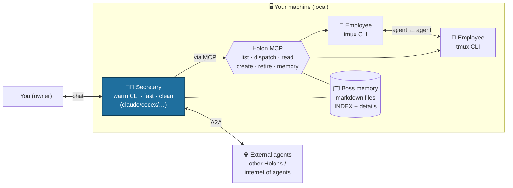

# Manage Your CLI

**Turn your CLI subscriptions (Claude Code, Codex, Gemini, Qwen, …) into a managed
team of agents.** A lean **Secretary** you chat with creates and dispatches
**employee** agents to do the heavy work — all running on *your own* CLI logins.

- **No API keys.** It drives the official CLI you're already logged into. Your
  subscription, your machine, your auth — we never touch tokens.
- **Thin shell.** All the intelligence is the CLI's. We add only **context, memory,
  orchestration, and a clean UI**. No RAG, no vector DB, no bespoke "AI" layer.
- **Gets better for free.** Every model/CLI upgrade upgrades the whole product.

> **Ban-safe by design:** each user drives the *official* CLI on their *own* machine
> with their *own* subscription — the safest, most vendor-aligned form of use. We
> never extract tokens, run subscriptions on a server, or share accounts.

## Architecture



**Connection structure:** *local agents ↔ Secretary ↔ you ↔ the outside* — an
**internet of agents**. The Secretary is the hub: it coordinates your local team and
is the single gateway out to other people's agents (over the **A2A** standard).

## The 6 core pieces

| # | Piece | What it is |
|---|---|---|
| 1 | **CLI–tmux shell** | Launch/drive official CLIs — Secretary as a *warm* headless process (~1s/turn); employees in persistent *tmux* (watchable, driveable). |
| 2 | **Agent ↔ agent comms** | Secretary orchestrates employees via the **Holon MCP**; **A2A** for event-driven + cross-machine ("internet of agents"). |
| 3 | **Clean UI** | Chat with the Secretary (clean reading surface), live roster, create-CLI flow. |
| 4 | **Persistent agents** | The Secretary (always-warm) + long-term employees (with a "soul" doc). |
| 5 | **Dynamic-agent UI** | Employees are created/retired on demand; the roster reflects them live. Everything dynamic — nothing hardcoded. |
| 6 | **Memory management** | File-based (markdown) memory at the *boss*: an index + detail files, **progressive disclosure**. A periodic memory-manager agent consolidates short→long term. No vector DB. |

## How it works

- **Secretary** = a *warm, persistent* official-CLI process (e.g. `claude --print
  --input-format stream-json …`, lean model + low effort). It pays the CLI cold-start
  **once**, then answers in ~1s and streams cleanly. It does light work itself and
  **dispatches heavy work to employees**.
- **Employees** = official CLIs in their own tmux sessions — you can watch or drive
  any of them directly. Created short-term by default, long-term on request.
- **Memory lives at the boss** as plain markdown (employees fetch what they need), so
  agents can be created and destroyed freely without losing knowledge. Each agent also
  has its own native `CLAUDE.md`/`AGENTS.md`.
- **No LLM config.** You log into your CLI(s) once; the app detects and uses them.

## Quickstart

```bash
corepack pnpm install
bash scripts/build-web.sh                 # production build
# serve the standalone build (bind 0.0.0.0); HOLON_OPEN_DEMO=1 = single-user, no device token
NODE_ENV=production HOSTNAME=0.0.0.0 PORT=3100 HOLON_OPEN_DEMO=1 \
  node apps/web/.next/standalone/apps/web/server.js
```

Then open the app, chat with your Secretary, and ask it to hire an employee.

## Status

Early. Branches: **`dev`** (work) → **`main`** (stable). Subscription-only, local-first.
Cloud/multi-user is a future open-core layer (it would use API keys — out of scope here).

---

*Built on the thin-shell principle: we don't build AI — we orchestrate the AI you
already pay for.*
