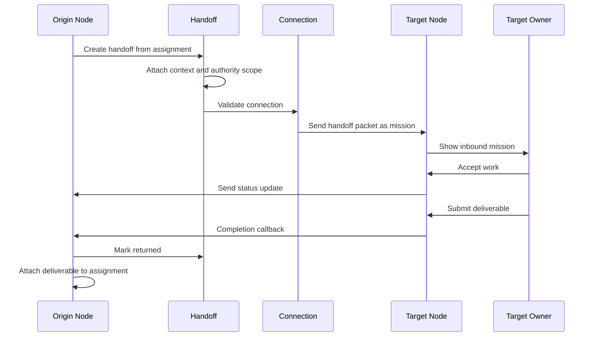

# Handoff Design

Status: draft
Date: 2026-05-15

## Purpose

Handoff is Holon's central accountability primitive.

Assignments describe work inside a node. Missions describe work received by a node. A handoff describes the moment work crosses an accountability boundary.

Holon should treat handoff as a first-class product object, not as a hidden API call.

## Definition

A handoff is:

```text
a structured transfer of responsibility
from one accountable owner boundary
to another accountable owner boundary
with scoped context, authority, expected output, and return path
```

The receiver can be:

- the same node's owner
- local AI member
- a peer member (Core-2 mirror of a paired remote desk)
- a remote human-owned node
- a future hosted team

## Why Handoff Matters

Without handoff, peer work becomes just "send a task to a URL." That is too weak for a workplace product.

Handoff gives Holon:

- human accountability
- visible ownership transfer
- audit trail
- scoped context sharing
- approval and rejection
- status tracking
- returned deliverables
- retry and escalation logic

## Handoff Is Not Delegation Alone

Delegation means "please do this."

Handoff means:

```text
I am transferring this work package to you under these conditions,
and I expect this artifact or decision back.
```

That package includes:

- requested outcome
- context
- constraints
- deadline
- permissions
- budget
- return channel
- audit identity

## Handoff Types

### Local Owner To Local AI Staff

```text
Owner -> Local AI Staff
```

This is the simplest handoff. It stays inside one node.

Use when:

- the owner wants local AI execution
- the runtime has enough context
- no remote human accountability is needed

### Owner To Proxy Staff

```text
Owner -> Proxy Staff -> Remote Node
```

This is the signature Holon handoff.

Use when:

- a remote real person owns the needed judgment
- work needs another person's context or relationships
- the local owner wants the remote person to decide how to execute

### Inbound Mission To Local Staff

```text
Remote Node -> Local Owner -> Local AI Staff
```

The local owner receives an inbound mission and hands it to local staff.

The upstream sender should see only accepted/submitted/blocked states unless the receiver chooses to expose more detail.

### Remote-To-Remote Cascade

```text
A -> B -> C
```

Each hop creates a separate handoff.

Important rule:

```text
A does not own C directly.
B owns the B -> C handoff.
```

This preserves human accountability and prevents cross-node command leakage.

## Handoff Object

Suggested schema:

```text
handoffs
- id
- source_node_id
- source_owner_id
- source_assignment_id nullable
- source_mission_id nullable
- target_type: owner | local_ai_staff | peer_staff | remote_node
- target_staff_id nullable
- target_node_id nullable
- target_connection_id nullable
- direction: local | outbound | inbound | cascade
- status
- title
- requested_outcome
- context_pack_id nullable
- authority_scope
- budget_limit nullable
- deadline_at nullable
- return_expected: deliverable | decision | status_only
- return_assignment_id nullable
- return_mission_id nullable
- created_at
- accepted_at nullable
- completed_at nullable
- rejected_at nullable
- blocked_at nullable
```

## Handoff States

```text
draft
proposed
sent
received
accepted
in_progress
blocked
submitted
returned
rejected
expired
cancelled
failed
```

### State Meaning

`draft`: created locally but not sent.

`proposed`: ready for owner confirmation.

`sent`: sent to receiver or remote node.

`received`: remote node accepted the packet but receiver has not accepted work.

`accepted`: receiver accepted accountability.

`in_progress`: receiver is actively executing.

`blocked`: receiver needs information, approval, or intervention.

`submitted`: receiver submitted output.

`returned`: origin received and attached the output.

`rejected`: receiver declined.

`expired`: no response before timeout.

`cancelled`: sender withdrew.

`failed`: protocol or system failure prevented transfer.

## Handoff Packet

A handoff packet is the serialized work package sent across boundaries.

Minimum packet:

```json
{
  "handoff_id": "handoff_123",
  "protocol_version": "v0",
  "source": {
    "node_id": "node_a",
    "label": "Alice's Desk"
  },
  "target": {
    "connection_id": "conn_456",
    "label": "Wang's Desk"
  },
  "work": {
    "title": "Research K-12 robotics funding",
    "requested_outcome": "Find 20 districts with funding signals",
    "deadline_at": "2026-05-20T17:00:00Z",
    "return_expected": "deliverable"
  },
  "context": {
    "summary": "Use the attached market brief and lead criteria.",
    "context_pack_id": "ctx_789"
  },
  "authority": {
    "can_delegate_locally": true,
    "can_forward": false,
    "budget_limit": 50
  },
  "return": {
    "callback_url": "https://alice.example.com/api/peer/done",
    "origin_assignment_id": "asg_123"
  }
}
```

## Context Pack

Handoff should not grant broad access by default.

Instead, a handoff includes a context pack:

- selected files
- instructions
- source links
- constraints
- previous deliverables
- relevant memory summaries
- allowed use mode

Allowed use modes:

```text
read
cite
summarize
transform
none
```

## Authority Scope

Every handoff must say what the receiver can do.

Examples:

```text
can_accept
can_reject
can_ask_question
can_delegate_locally
can_forward
can_spend_budget
can_use_external_tools
can_return_partial
```

Default MVP policy:

- receiver can accept, reject, ask question, and complete
- receiver can delegate to local AI member
- receiver cannot forward to another peer member unless explicitly allowed
- receiver cannot see source node internals

## Handoff And Assignment Mapping

Outbound peer path:

```text
Assignment A created on Node A
  -> Handoff H created on Node A
  -> Mission M created on Node B
  -> Deliverable D returned to Node A
  -> Assignment A completed
  -> Handoff H returned
```

Inbound path:

```text
Mission M received on Node B
  -> Handoff H_in recorded on Node B
  -> Assignment B1 optionally created for local execution
  -> Deliverable D created on Node B
  -> Callback returns D upstream
```

## Handoff Timeline

Every handoff should render as a timeline:

```text
Created
Prepared context
Sent
Received
Accepted
In progress
Submitted
Returned
Completed
```

Failure timeline:

```text
Created
Sent
Dispatch failed
Retrying
Retrying
Blocked: remote offline
Owner notified
```

## UI Requirements

Handoff must be visible in:

- assignment detail
- mission detail
- peer member profile
- connection detail
- deliverable provenance

Card labels:

```text
Handoff to Wang's Desk
Waiting for remote acceptance
Remote work in progress
Returned with deliverable
Blocked: invalid token
```

Do not show handoff as raw protocol language in primary UI.

Good UI language:

- sent to
- accepted by
- waiting for
- returned by
- blocked by

Avoid primary UI language:

- callback URL
- peer_origin_id
- transport
- bearer token

## Sequence



## MVP Requirements

MVP should implement handoff enough to support peer members reliably:

- handoff table or equivalent persisted model
- handoff id on outbound peer assignments
- mission created from handoff packet
- status mapping between handoff and mission
- completion callback updates handoff and assignment
- handoff timeline in assignment detail
- visible failure/retry states

## Defer

- handoff negotiation thread
- partial deliverable protocol
- multi-party handoff
- payment/compensation
- public org graph
- encrypted context packs
- formal contract signing

## Invariants

1. A handoff always crosses an accountability boundary.
2. A handoff always has a sender and receiver.
3. A handoff always has expected return behavior.
4. A handoff never grants broad context by default.
5. Multi-hop work creates multiple handoffs, not one global command chain.
6. The origin node owns the origin assignment; the target node owns local execution.
